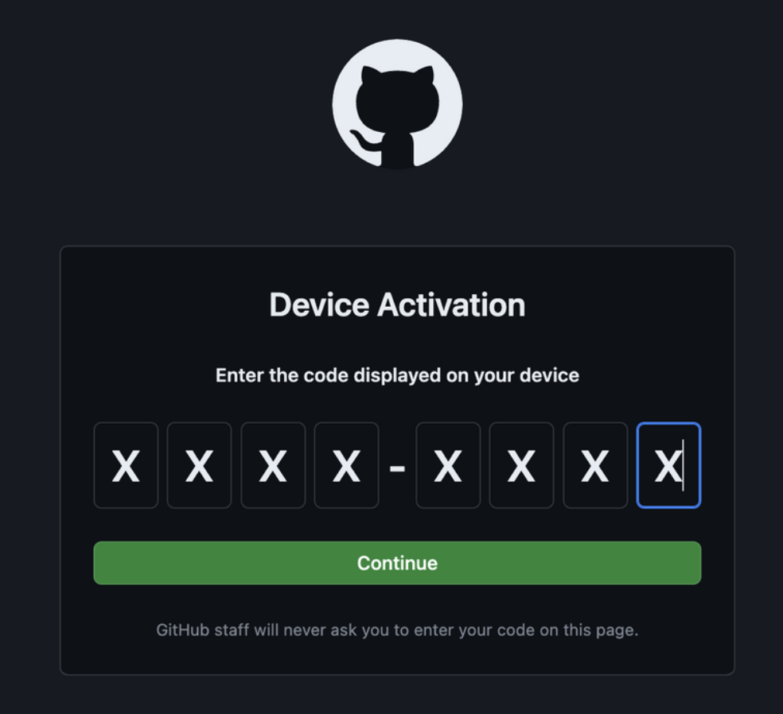
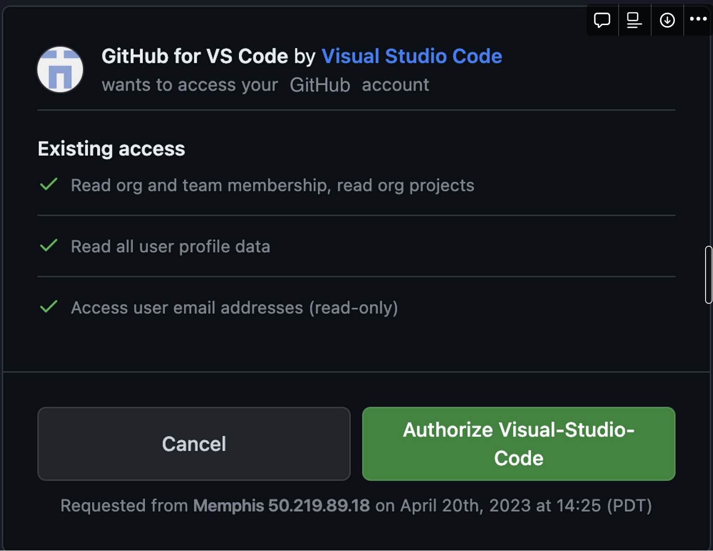

# Interactive Runs
<!-- TODO: change this? -->
Interactive runs give the ability to debug and iterate quickly inside your cluster in a secure way.
Interactivity works on top of the existing Mosaic AI Training runs, so before connecting a run workload needs to be submitted to the cluster.
For security purposes storage is not persisted, so we recommend utilizing your own cloud storage and git repositories to stream and save data between runs.

## Launch an interactive run

```{admonition} Launching new runs
All runs on reserved clusters can be connected to, regardless of how they were launched.
This section goes over `mcli interactive`, which is a helpful alias for creating simple “sleeper” runs for interactive purposes.
You can also create a custom run configuration for interactive purposes through the normal `mcli run` entrypoint
```

Launch an interactive run by running:

```bash
mcli interactive --max-duration 1 --gpus 1 --tmux --cluster <cluster-name>
```

This command creates a "sleeper" run that will last for 1 hour (`--max-duration 1`), request 1 GPU (`--gpus 1`) and connect to a `tmux` session (`--tmux`) within your run.
The `--max-duration` or `--hours` argument is _required_ to avoid any large, accidental charges from a forgotten run.
The `--tmux` argument is _strongly recommended_ to allow your session to persist through any temporary disconnects.
`mcli` will automatically try to reconnect you to your run whenever you disconnect, so utilizing `tmux` dramatically improves this experience.

Note that interactive runs act like normal runs:

```bash
# see interactive runs on the cluster
mcli util <cluster-name>

# your interactive runs will show up when you call "get runs"
mcli get runs --cluster <cluster-name>

# get more info about your run
mcli describe run <interactive-run-name>

# stop your interactive run early
mcli stop run <interactive-run-name>

# delete it
mcli delete run <interactive-run-name>
```

<details>
  <summary>Full documentation for the interactive command</summary>

```{admonition} Multi-node support
Multi-node interactive runs are currently only supported on reserved, single-tenant clusters
```

```{argparse}
---
module: mcli.cli.m_interactive.m_interactive
func: configure_argparser
passparser:
prog: mcli interactive
---
```

</details>

## Update a run's max duration

After creating an interactive run, you can change its maximum duration.

```bash
mcli update run <interactive-run-name> --max-duration <hours>
```

## Connect to a run in the terminal

Regardless of how you launched the run, you can connect to any active run using:

```bash
mcli connect <run-name> --tmux
```

By default, the session will connect inside a bash shell.
We highly recommend using tmux as the entrypoint for your run so your session is robust to disconnects (such as a local internet outage).
You can also configure a command other than bash or tmux to execute in the run:

```bash
mcli connect --command "top"
```

If you are running multi-node interactive runs, you can specify the zero-indexed node rank via:

```bash
mcli connect --rank 2
```

## Connect to a run with VSCode

```{admonition} Disclaimer
Due to [VSCode Server licensing](https://code.visualstudio.com/docs/remote/faq#_can-i-use-the-vs-code-remote-development-extensions-to-build-my-own-product-or-service), we cannot integrate directly with the native VS code remote development extensions.
This guide outlines and documents how to get started with the VSCode server using tunneling
```

**First time local setup**: [Install VSCode](https://code.visualstudio.com/download) and the [remote development extension pack](https://marketplace.visualstudio.com/items?itemName=ms-vscode-remote.vscode-remote-extensionpack).
We recommend reviewing the system requirements and installation guide for the extension pack as some requirements are highly dependent on your operating system.

**Step 1**: Create an interactive run as documented above

**Step 2**: Connect to that run via `mcli connect`

**Step 3**: Run the following commands to download VS Code server and start it:

```bash
trap '/tmp/code tunnel unregister' EXIT
cd /tmp && curl -Lk 'https://code.visualstudio.com/sha/download?build=stable&os=cli-alpine-x64' --output vscode_cli.tar.gz
tar -xf vscode_cli.tar.gz
/tmp/code tunnel --accept-server-license-terms --no-sleep --name mml-dev-01
```

This will output something like:

```
*
* Visual Studio Code Server
*
* By using the software, you agree to
* the Visual Studio Code Server License Terms (https://aka.ms/vscode-server-license) and
* the Microsoft Privacy Statement (https://privacy.microsoft.com/en-US/privacystatement).
*
To grant access to the server, please log into https://github.com/login/device and use code ABCD-1234
```

**Step 4**: Authenticate using the code provided [here](https://github.com/login/device) and authorize your github account

|                                                               |                                                        |
| ------------------------------------------------------------- | ------------------------------------------------------ |
|  |  |

**Step 5**: From an existing VSCode window, connect using remote tunnel by selecting the blue remote window button on the very left of bottom sidebar.
Select "Connect to tunnel" from "Remote-Tunnels" and then select the tunnel name (default: "mml-dev-01")


Alternatively, you can connect in the browser at: https://vscode.dev/tunnel/mml-dev-01/tmp

## Connect to a run with Jupyter Notebooks, via VSCode

Follow the steps above to set up an interactive instance via VSCode, then install the [Jupyter extension](https://marketplace.visualstudio.com/items?itemName=ms-toolsai.jupyter) and specify a kernel. Once configured, you should be able to run any .ipynb notebook in your interactive instance via VSCode!